<div align="center">

# Clearance

### Resume screening with a real audit trail — and honest numbers.

Every resume is **security-scanned**, **PII-redacted**, **classified**, **scored against a job description**, and **logged as an immutable case record** — behind **JWT authentication**, with a built-in **bias audit**. Nothing is scored before it is scanned and redacted, and that ordering is enforced in the backend, not implied by the UI.

**Decision support, not automation.** No score from this system should be the reason a human does not read a resume.


<br/>


</div>

---

## Table of contents

- [Why this project exists](#why-this-project-exists)
- [System architecture](#system-architecture)
- [The screening pipeline](#the-screening-pipeline)
- [Data model](#data-model)
- [Authentication and abuse control](#authentication-and-abuse-control)
- [The honest numbers](#the-honest-numbers)
- [The data-leakage story](#the-data-leakage-story)
- [Screenshots](#screenshots)
- [Quickstart](#quickstart)
- [Trying it with the bundled demo](#trying-it-with-the-bundled-demo)
- [API reference](#api-reference)
- [Testing and CI](#testing-and-ci)
- [Privacy and security model](#privacy-and-security-model)
- [Project structure](#project-structure)
- [Technology choices](#technology-choices)
- [Limitations](#limitations)

---

## Why this project exists

The most-copied resume-classification notebook online reports about **99% accuracy**. That number is an artifact of **data leakage**: the dataset contains each resume many times over, so a random train/test split grades the model on documents it has already memorized.

Clearance is the version that tells the truth. It removes the leakage, proves the honest accuracy, ships a regression test that makes the bug impossible to reintroduce, and wraps the model in the things a real screening tool needs but demos usually skip: a security gate, PII redaction, an explainable score, an audit trail, authentication, and a fairness check.

---

## System architecture

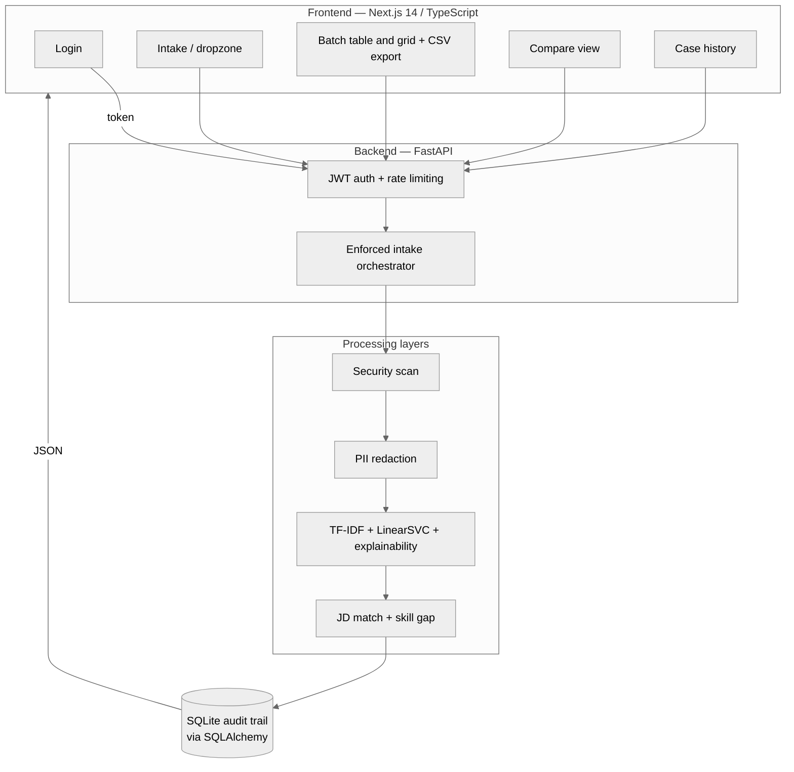

Each layer is independent: the security, privacy, model, and matching modules can be swapped without touching the others. Optional dependencies (spaCy, sentence-transformers, oletools) upgrade behaviour automatically when present and are never required.

---

## The screening pipeline

The order is guaranteed in `api/main.py::_screen_one`, not in the UI. A file is never parsed until it has passed the security scan, and raw text never survives past redaction.

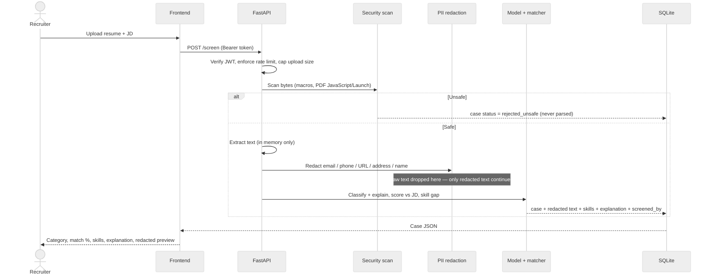

---

## Data model

One screening writes a linked set of rows across five tables. Rejects and errors still produce a `cases` row — that is what makes it an audit trail rather than a results list.

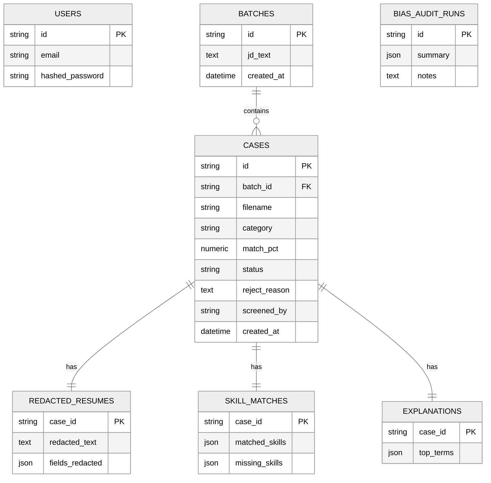

The only resume text stored anywhere is `redacted_resumes.redacted_text`. The raw file and unredacted text live only inside the request handler, in memory.

---

## Authentication and abuse control

Recruiters authenticate with email and password and receive a signed JWT. Every later request is verified by signature — stateless, no database hit per call. Each case records `screened_by`, so the audit trail captures **who** ran a screening, not just what happened.

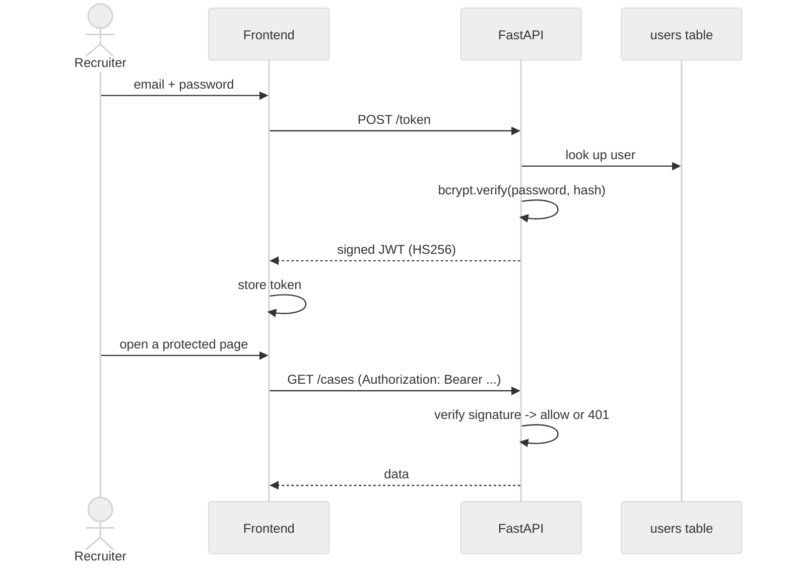

| Control | Value | Purpose |
|---|---|---|
| Passwords | bcrypt hash only | A database leak never exposes credentials |
| Token | JWT / HS256, signed with `CLEARANCE_SECRET_KEY` | Stateless auth, cannot be forged without the key |
| Rate limit — `/token` | 20 / minute per IP | Throttles credential guessing |
| Rate limit — `/screen` | 30 / minute per IP | Prevents endpoint abuse |
| Rate limit — `/batch` | 10 / minute per IP | Prevents mass upload abuse |
| Upload cap | 10 MB per file, read in chunks | Prevents memory-exhaustion uploads |

Secrets are read from the environment; the built-in key is for local development only. `/health` is intentionally public.

---

## The honest numbers

| Setup | Accuracy | f1_macro | Verdict |
|---|---|---|---|
| Repo dataset, duplicates left in (the original notebook) | **99.5%** | — | **Fake.** The test set is memorized training data. |
| Repo dataset, deduplicated first | 88.2% | 0.821 | Honest but fragile — a 34-document test set. |
| **Kaggle 2,484-resume dataset, 24 classes (this model)** | **68.4%** | **0.638** | Honest. CV winner LinearSVC. |

68% is the real state of TF-IDF plus linear models on 24-way resume classification; published results agree, and transformer fine-tunes reach the low-to-mid 80s. Because Clearance produces a **ranked shortlist**, `models/train.py` also reports **top-3 accuracy** — whether the true category is among the model's top three guesses — which is the metric that matches how the tool is actually used.

---

## The data-leakage story

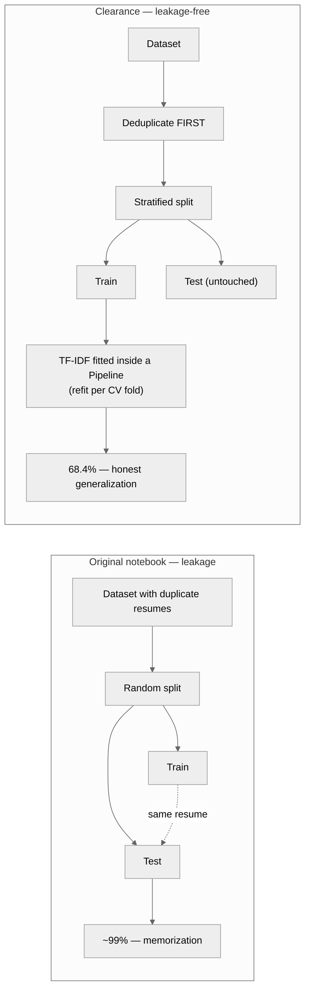

Two defenses, both enforced: deduplicate before splitting, and keep the vectorizer inside the `Pipeline` so cross-validation refits it per fold and validation text never leaks vocabulary. A regression test (`tests/test_no_leakage.py`) uses a booby-trapped vectorizer that raises the instant any held-out document reaches a `.fit()` call, so the bug cannot silently return.

---

## Screenshots

> Captured from the bundled demo (four resumes screened against the Senior Accountant JD).

<div align="center">

### Sign in — the API is access-controlled
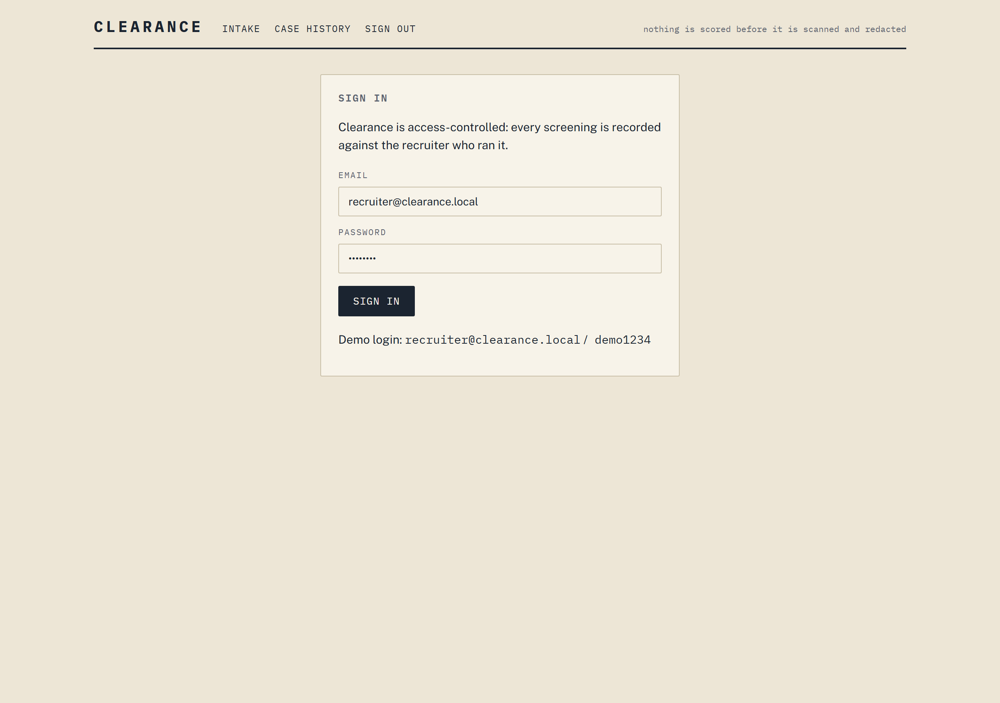

### Evidence intake
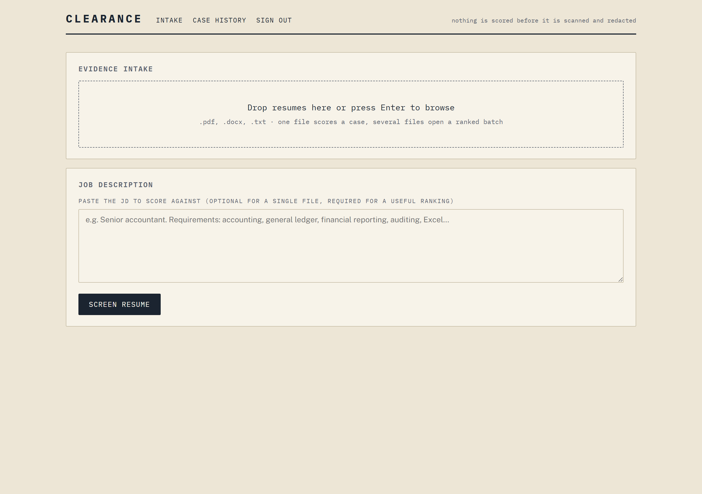

### Case card — category, match stamp, matched and missing skills, explanation, redacted text
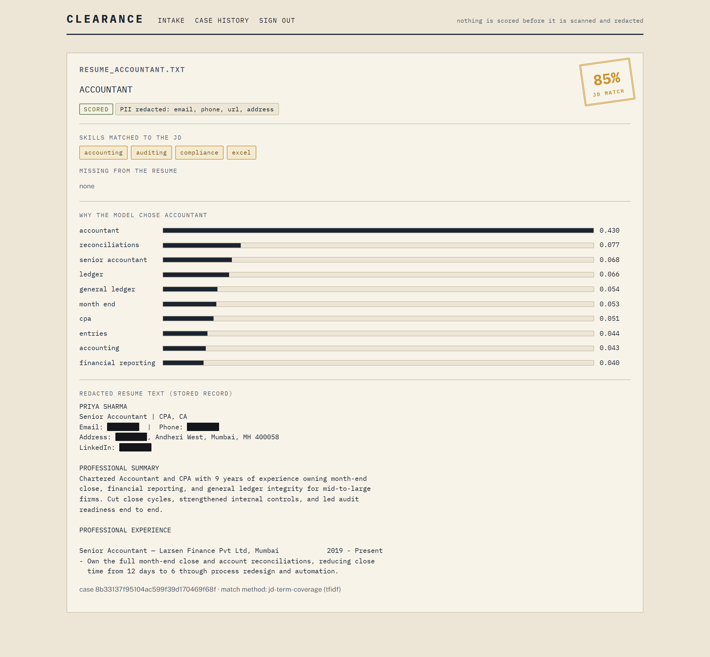

### Ranked batch — table view, one-click CSV export, and the permanent bias-audit disclosure
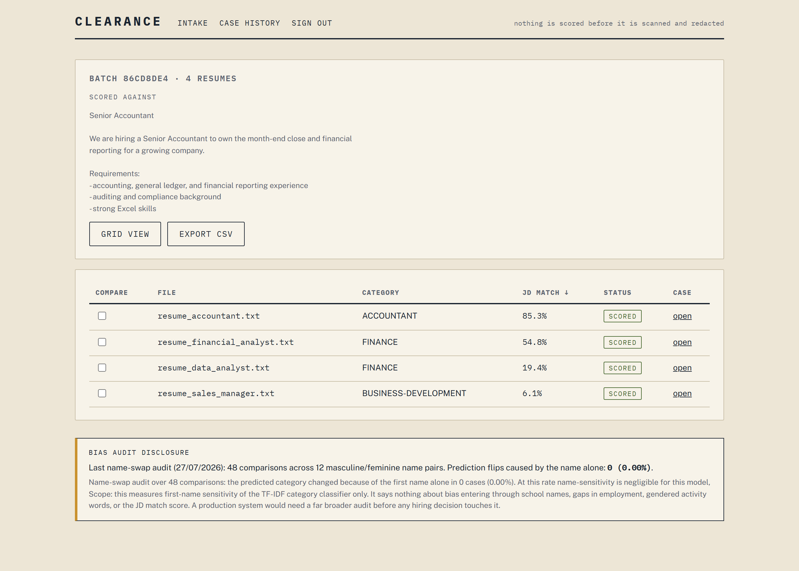

### Ranked batch — grid view
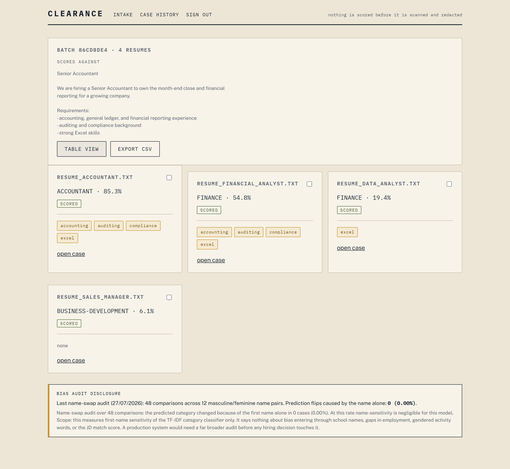

### Side-by-side compare with unique-skill diff
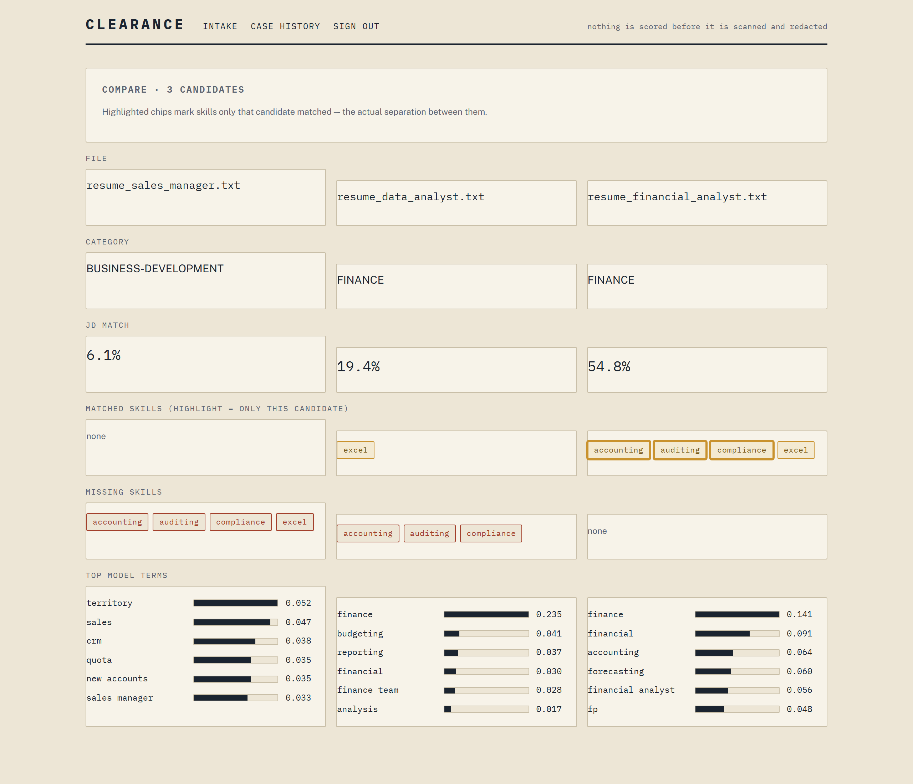

### Case history and the permanent bias-audit disclosure
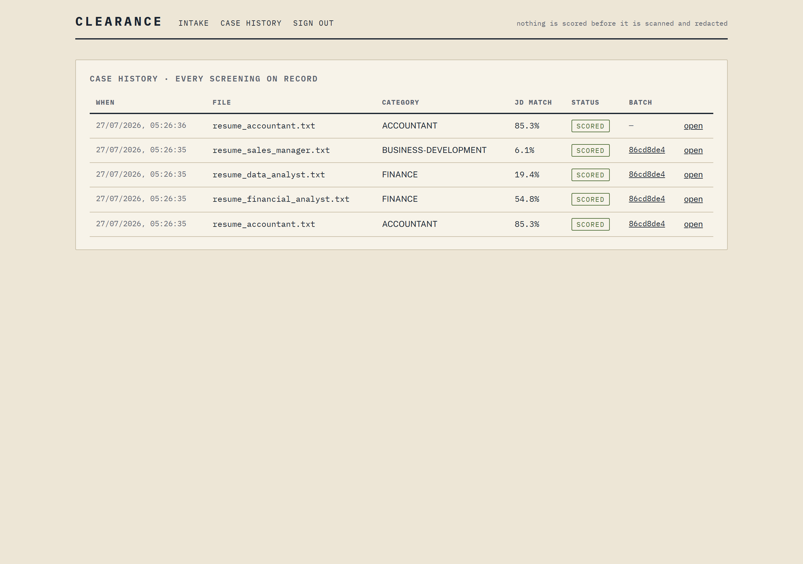

</div>

---

## Quickstart

Prerequisites: Python 3.10+, Node 18+.

### Option A — Docker (whole stack, one command)

```bash
docker compose up --build
```

Backend on `http://localhost:8000` (interactive docs at `/docs`), frontend on `http://localhost:3000`. The SQLite audit trail persists in a named volume.

### Option B — run each service directly

Backend:

```bash
cd backend
python -m venv .venv && source .venv/bin/activate
pip install -r requirements.txt
uvicorn api.main:app --reload --port 8000
```

Frontend, in a second terminal:

```bash
cd frontend
npm install
npm run dev
```

Open `http://localhost:3000` and sign in with the seeded demo recruiter:

```
email:    recruiter@clearance.local
password: demo1234
```

The trained model ships in `backend/artifacts/`, and `clearance.db` plus the demo user are created automatically on first startup. No database server, no migrations.

---

## Trying it with the bundled demo

The `demo_data/` folder contains four full resumes (with fake PII to demonstrate redaction) and a Senior Accountant job description. Screening all four produces a clean ranking:

| Candidate | Predicted category | JD match |
|---|---|---|
| Priya Sharma — Senior Accountant | ACCOUNTANT | 85.3% |
| Rohit Verma — Financial Analyst | FINANCE | 54.8% |
| Ananya Iyer — Data Analyst | FINANCE | 19.4% |
| Arjun Mehta — Sales Manager | BUSINESS-DEVELOPMENT | 6.1% |

In the UI, drop all four files on the intake screen and paste `demo_data/jd.txt` to reproduce the ranked batch, then select candidates and compare them. Every case shows `email, phone, url, address` redacted.

---

## API reference

| Method | Route | Auth | Purpose |
|---|---|---|---|
| POST | `/token` | public | Exchange email + password for a JWT |
| POST | `/screen` | required | One file + JD → scan → redact → classify → match → persist → case JSON |
| POST | `/batch` | required | Many files + one JD → one batch, one case per file, ranked |
| GET | `/cases/{id}` | required | Retrieve a past case |
| GET | `/cases?limit=N` | required | Most recent cases, newest first |
| GET | `/batches/{id}` | required | A past batch with all cases, ranked |
| GET | `/compare?case_ids=a,b[,c,d]` | required | 2–4 cases aligned, with per-candidate unique-skill diff |
| GET | `/bias-report` | required | Latest bias-audit run for the permanent disclosure |
| GET | `/health` | public | Model-loaded check and active match method |

Every scored case returns: `id`, `category`, `match_pct`, `status`, `screened_by`, `fields_redacted`, `redacted_preview`, `matched_skills`, `missing_skills`, `top_terms`, and `match_method`.

---

## Testing and CI

```bash
cd backend
pytest tests/ -v
```

| Test file | Guarantee it protects |
|---|---|
| `test_no_leakage.py` | No resume crosses the train/test boundary; held-out text never reaches `.fit()` |
| `test_pii.py` | Every PII field is removed and honestly reported; clean text is never over-redacted |
| `test_file_scan.py` | Clean files pass; macros, spoofed files, and executable PDF actions are rejected |
| `test_auth.py` | Login works, protected routes reject without a token and accept with one, and `screened_by` is recorded |

The PII, security, and auth tests build every fixture in memory and need no dataset. The whole suite runs in GitHub Actions (`.github/workflows/ci.yml`) on every push, so none of these guarantees can silently regress.

---

## Privacy and security model

**What is never stored** (memory-only inside one request, then dropped): the raw uploaded file, the unredacted text, and all identifying PII.

**What is stored**: redacted resume text, the derived category, score, skills, and explanation, and a note of which recruiter ran the screening.

**Security gate** (before any parsing):

- DOCX is inspected as a ZIP for the embedded macro payload; `.docm` / `.dotm` are rejected outright.
- PDF structure is parsed and only executing actions (`/JavaScript`, `/Launch`) are rejected; a benign go-to-page `/OpenAction` is allowed, so legitimate LaTeX and Canva exports are not false-rejected.
- Unsafe files are logged as `rejected_unsafe` and never parsed.

---

## Project structure

```
clearance/
├── backend/
│   ├── api/main.py              FastAPI app, JWT + rate limiting, enforced intake order
│   ├── security/
│   │   ├── file_scan.py         macro / PDF-action pre-check
│   │   └── auth.py              bcrypt hashing + JWT issue/verify
│   ├── preprocessing/
│   │   ├── cleaning.py          text normalisation for the model
│   │   └── pii.py               redaction; returns redacted text + what was masked
│   ├── models/
│   │   ├── train.py             dedup → split → 5-fold CV × 3 models → held-out report + top-3
│   │   ├── explain.py           exact linear-model term contributions
│   │   └── bias_audit.py        name-swap audit → bias_audit_runs
│   ├── matching/
│   │   ├── embeddings.py        JD match score (term coverage / sentence-transformers)
│   │   └── skill_gap.py         matched / missing skills vs the JD
│   ├── db/                      SQLAlchemy models + session
│   ├── tests/                   leakage, PII, file-scan, and auth guarantees
│   ├── artifacts/               trained model, CV tables, reports, confusion matrices
│   └── Dockerfile
├── frontend/
│   ├── app/                     App Router pages: login, intake, case, batch, compare, history
│   ├── components/              case card, nav, auth gate
│   ├── lib/api.ts               typed fetch wrapper with token handling
│   └── Dockerfile
├── demo_data/                   four sample resumes + a job description
├── docker-compose.yml
└── .github/workflows/ci.yml
```

---

## Technology choices

| Concern | Choice | Reason |
|---|---|---|
| API framework | FastAPI | Auto-generated interactive docs, type-driven validation, async file uploads |
| Model | TF-IDF + LinearSVC | Strong on small high-dimensional text; explanation is the model itself |
| Explainability | Exact `tfidf × coefficient` | No post-hoc approximation for a linear model |
| Database | SQLite via SQLAlchemy | Zero setup, single inspectable audit file; Postgres is a connection-string change |
| Auth | JWT (HS256) + bcrypt | Stateless verification; credentials never stored in plaintext |
| Frontend | Next.js 14 + TypeScript | App Router, typed API client, custom design system |

---

## Limitations

Stated because a screening tool that hides its limits is worse than none: 24-way single-label classification punishes genuinely multi-label resumes; the model is English-only; regex redaction misses names unless spaCy is installed, and no redactor catches every identifier; the skill list is curated, not learned; the bias audit covers first-name sensitivity only; exact-duplicate removal does not catch near-duplicates; and stored records have no automatic retention policy yet. The honest held-out accuracy is 68.4% — a ranked shortlist with visible explanations, not an automated decision-maker.
